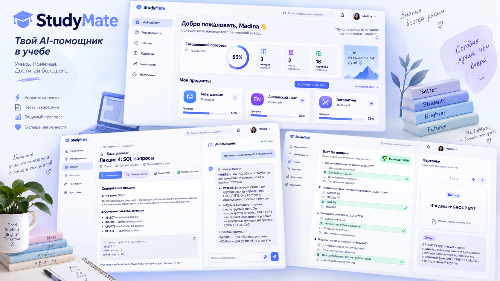

# Визуальное направление StudyMate

**Согласовано пользователем:** светлый, дружелюбный, аккуратный учебный сервис
с синими и фиолетовыми акцентами. Не заменять его другим стилем без обсуждения.

Макет — концептуальное изображение, а не точная спецификация всех надписей и цифр.
Не переносить ошибки мелкого текста, демонстрационное имя и выдуманные результаты в реальные данные.
Наклонённые окна, книги и растения вокруг экранов — подача макета, не обязательный фон каждой страницы.
Рабочий интерфейс остаётся прямым, читаемым и удобным.

## Палитра для будущих CSS-переменных

HEX ниже — предложенная реализация близкого визуального направления, а не точное извлечение пикселей.

| Переменная | Цвет | Роль |
| --- | --- | --- |
| `--color-bg` | `#F5F7FF` | Общий фон |
| `--color-surface` | `#FFFFFF` | Карточки и панели |
| `--color-primary` | `#5265F6` | Основные кнопки и действия |
| `--color-accent` | `#8758F3` | Второй акцент и мягкие градиенты |
| `--color-primary-soft` | `#E9EDFF` | Активный пункт меню |
| `--color-text` | `#171D4B` | Основной текст и заголовки |
| `--color-muted` | `#626B8A` | Второстепенный текст |
| `--color-border` | `#E5E9F5` | Тонкие разделители |
| `--color-success` | `#11785B` | Текст успешного результата |
| `--color-success-soft` | `#E6F7EE` | Фон правильного ответа |
| `--color-danger` | `#B3263E` | Ошибки |

Проверять контраст готовых сочетаний. Цвет не должен быть единственным признаком ошибки или успеха.

## Геометрия и шрифт

Предлагаемые значения: карточки 16–20 px, поля и кнопки 10–12 px, свободные промежутки
8/12/16/24/32 px. У карточек тонкая граница и лёгкая тень, без тяжёлого стекла и сильного свечения.
Базовый шрифт — системный sans-serif; при необходимости позже выбрать поддерживающий кириллицу
веб-шрифт с подходящей лицензией. Файлов шрифтов в архиве нет.

## Основной каркас

На широком экране слева вертикальное меню, сверху поиск и профиль, справа основное содержимое.
Меню: «Мой кабинет», «Мои предметы», «Лекции», «Карточки», «Результаты», «Настройки».
На странице лекции чат располагается справа, после появления соответствующей функции.
На телефоне меню убирается в открываемую панель, карточки выстраиваются в один столбец,
чат не сжимает материал — открывается отдельной панелью или вкладкой.

## Компоненты первой очереди

Sidebar, Header, PageContainer, Button, Card, Input, Modal, EmptyState, LoadingState,
ErrorState, SubjectCard. Добавлять по необходимости, не строить библиотеку ради библиотеки.

На всех экранах показывать реальное состояние: загрузку, отсутствие данных, ошибку, успешное действие.
Кнопка без реализации не должна изображать работающий ИИ. Для макетов использовать явную подпись «Демо».
Процент «65%» на картинке не является формулой прогресса — показатели нужно согласовать отдельно.

## Доступность

Видимый фокус, подписи полей, управление с клавиатуры, корректные заголовки, закрытие диалога
и возврат фокуса, понятные сообщения об ошибках. Не задавать мелкий размер текста ради сходства
с уменьшенной картинкой. Проверить широкую, планшетную и мобильную ширину.
